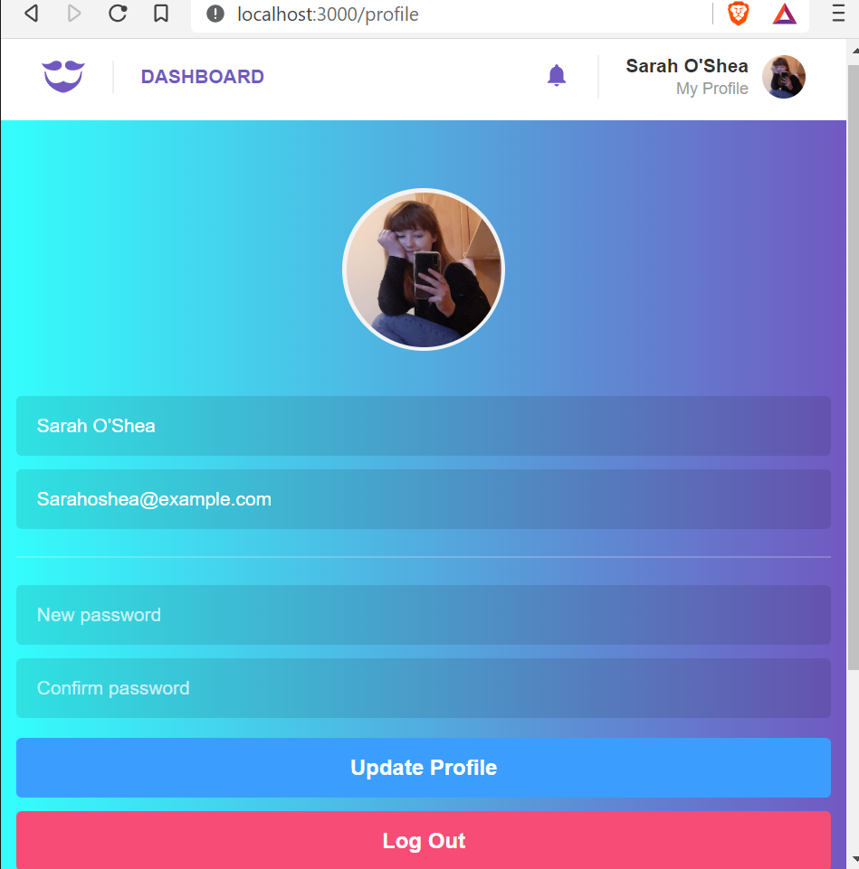
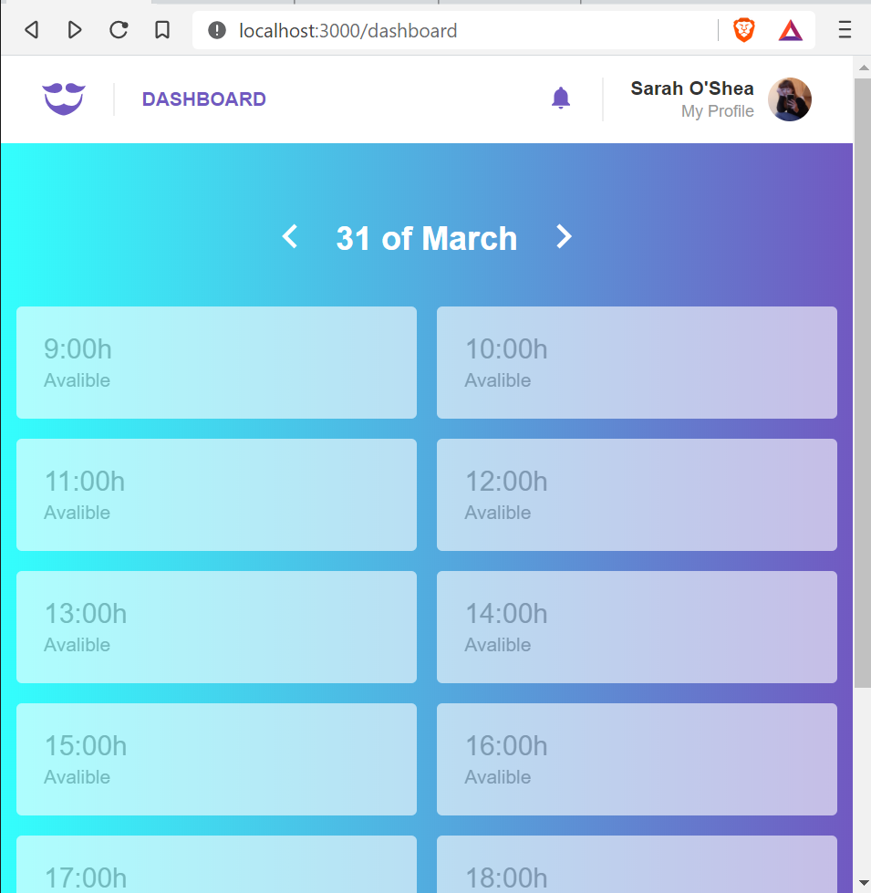
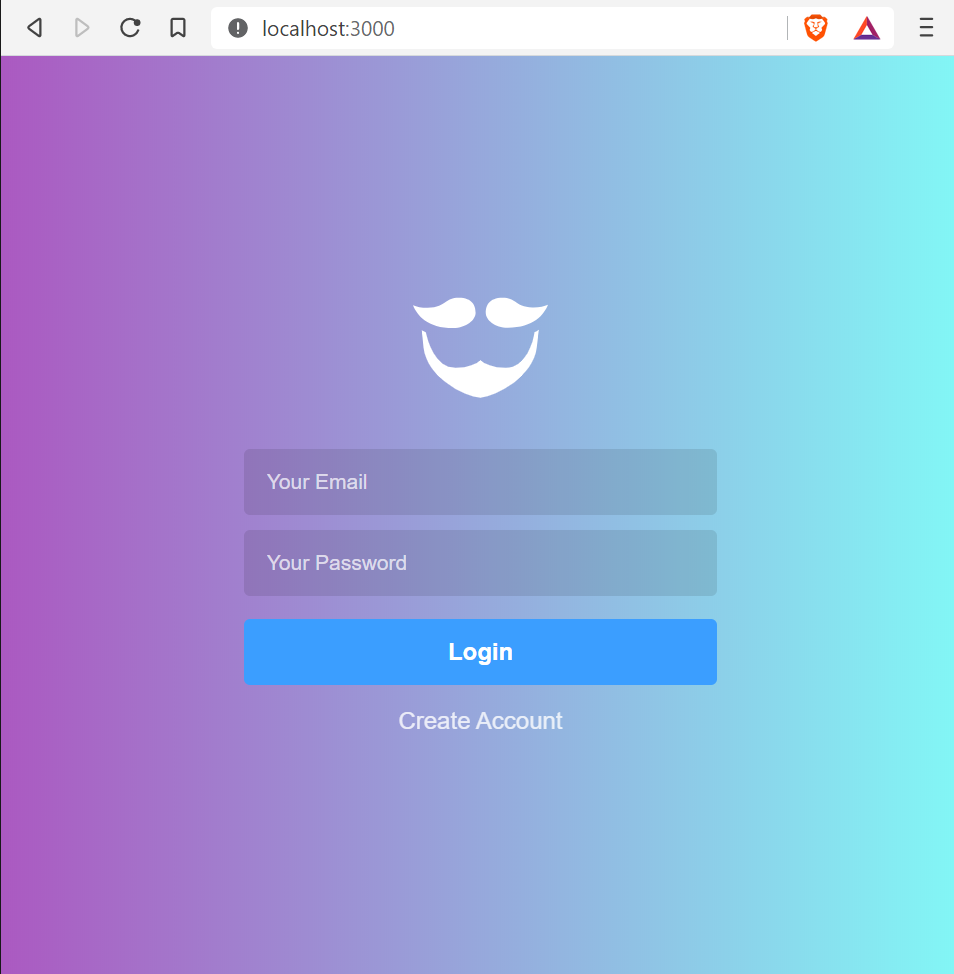
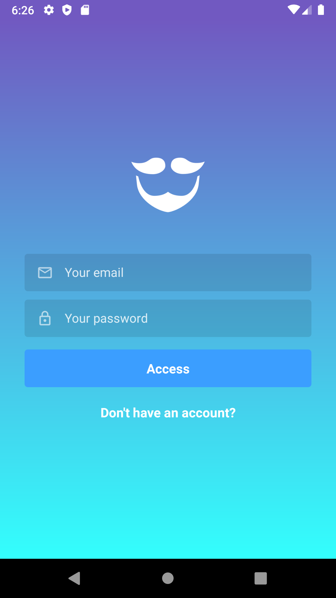
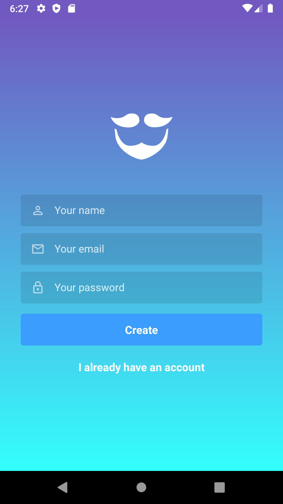
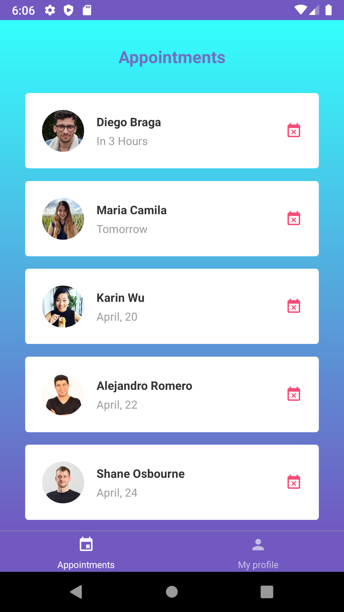
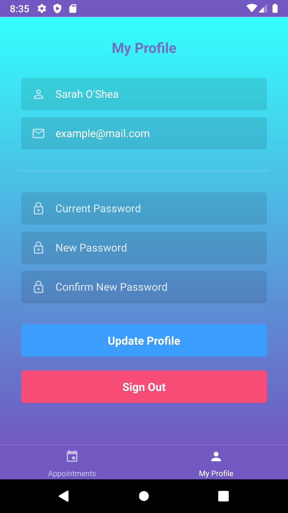

<h1 align="center">
 
  
 
 
Gobarber API
</h1>

An barber API generates appointments >

  

## Features

- [Node.js](https://nodejs.org/en/) 8.0.0 ou >
- [Yarn](https://yarnpkg.com/pt-BR/docs/install)

A Node.js API built with Express and all the latest tools and best practices in development!

- 📗 **Express** — Microframework for Node.js
- 📕 **Sequelize** — SQL dialect ORM for Node.js
- 📙 **MongoDB** — document-based database
- 📒 **Redis** — key-value data model
- 📔 **Yup** - Object schema validation
- 📘 **Sentry** - cross-platform application monitoring
- 📧 **Nodemailer** - Send e-mails with Node.JS
- ✅ **Lint** — ESlint/Prettier/Editor Config

## Get Started

1. Clone this repository.
2. cd:/backend Run `yarn` to add dependencies. 
3. Run `yarn dev` and `yarn queue` to run the background jobs at your `http://localhost:3000` 
4. Replace all environment variables. 

## Create 3 diferents containers using docker for your Database.

- `docker run --name redisbarber -p 6379:6379 -d -t redis:alpine`;
- `docker run --name mongobarber -p 27017:27017 -d -t mongo`;
- `docker run --name some-postgres -e POSTGRES_PASSWORD=docker -p 5433:5432 -d postgres`;

! Rebooting your machine, you'll need start your containers.
💖💖💖💖

<h1 align="center">
 
 
Gobarber Web
</h1>

Using this App you can see who booked, the appointment list day and hour cosuming the API.

  
  

## Features

This app features all the latest tools and practices in web development!

- ⚛ **React** — A library to build user interfaces
- ♻ **Redux with Redux Saga** — State management with middleware
- 💅 **CSS** — styled-components
- 🌸 **Reactotron** - Helps debugging process
- 💖 **Lint** — ESlint/Prettier/Editor Config

## Get started

1. Make sure backend is Runing `yarn dev`
2. cd directiry `"web"`. 
3. Run `yarn` to install dependencies. 
4. Run `yarn start` the App.

  

<h1 align="center">
 
 
Gobarber Mobile
</h1>

Using this App you can book Appointments, see if appointments are avalible list day and hour cosuming the API.

  
  

## Features

This app features all the latest tools and practices in web development!

- ⚛ **React Native** — A library to build user interfaces
- ♻ **Redux Redux Saga** — State management with middleware
- 💅 **CSS** — styled-components
- 🌸 **Reactotron** - Helps debugging process
- 🚢 **React-navigation** — Lib helps in the navigation building
- 🌐 **Axios** — Supports the Promise API
- ⌚ **date-fns** — Lib helps date/hours converse
- 💖 **Lint** — ESlint/Prettier/Editor Config

## Get started

1. Make sure backend is Runing `yarn dev`
2. cd directiry `"mobile/gobarber"`. 
3. Run `yarn` to install dependencies. 
4. Run `react-native run-android` to build the App.
4. to restart the app Run `react-native start`.

   

## Contributing

Please read [CONTRIBUTING.md](CONTRIBUTING.md) for details on our code of conduct, and the process for submitting pull requests.

## License

This project is licensed under the MIT License - see the [LICENSE.md](LICENSE.md) file for details.

